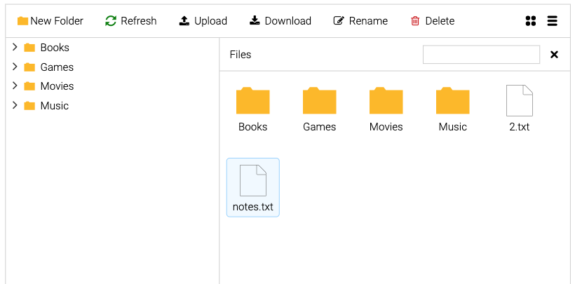

# ngx-explorer

Lightweight and easy-to-use Angular File Explorer module.
This is a front-end implementation only. There are no services at this point.



See live [Demo](https://artemnih.github.io/ngx-explorer/)

## Prerequisites

-   Angular 17+

## How to use

1. [Install package](#1-install-package)
2. [Provide `IDataService` implementation](#2-data-service)
3. [Add to template](#3-add-to-template)
4. [Styles](#4-styles)

### 1. Install package

```bash
npm i ngx-explorer
```

### 2. Data Service

Implement `IDataService` provider interface which contains API for fetching data from the server.

```Typescript
import { IDataService } from 'ngx-explorer';

export class MyDataService implements IDataService<MyDataType> {
    ...
}
```

And provide the implementation:

```TypeScript
 { provide: DataService, useClass: ExampleDataService },
```

### 3. Add to template

Import components from `ngx-explorer` and provide in `imports` array in either module, main.ts or component.

```Typescript
    imports: [ExplorerComponent],
```

and add tags to the template:

```html
<nxe-explorer></nxe-explorer>
```

See list of available components [here](docs/COMPONENTS.md)

### 4. Styles

-   Add css import `styles.scss`:

```scss
@import 'ngx-explorer/src/assets/icons/css/nxe.css';
```

## APIs

All the communication with the server is done through the `ExplorerService` APIs. It provides methods for fetching data, creating, renaming, deleting files and directories.

```Typescript
import { ExplorerService } from 'ngx-explorer';
...
constructor(private explorerService: ExplorerService) {

    // start explorer by loading root level data
    explorerService.openNode();

    // subscribe to tree updates
    explorerService.root$.subscribe((root) => {
        console.log('Root:', root);
    });
}
```

## Customization

See [Customization](docs/CUSTOMIZATION.md) for more details.

## Author

[@artemnih](https://github.com/artemnih)

[](https://github.com/artemnih)
